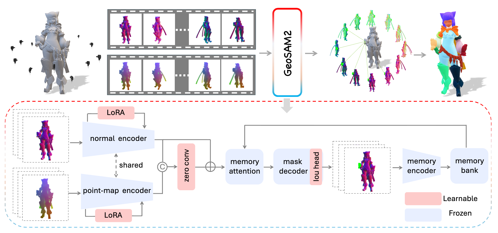

# GeoSAM2: Unleashing the Power of SAM2 for 3D Part Segmentation

> **Accepted at CVPR 2026.**

<div align="center">

[](https://detailgen3d.github.io/GeoSAM2/)
[](https://arxiv.org/abs/2508.14036)
[](https://huggingface.co/VAST-AI/GeoSAM2)
[](LICENSE)

</div>



GeoSAM2 lifts SAM2 from images to 3D meshes. It takes a multi-view rendering of
a mesh, accepts an interactive prompt (a single 2D click or a 2D mask) on one
view, propagates a consistent segmentation across all views, and back-projects
the result to obtain a per-face 3D part labelling.

This repository contains the **inference** code, configs, and a small demo
dataset. Training/fine-tuning code is intentionally not included.

---

## Repository layout

```
GeoSAM2/
├── inference.py                       # Multi-view 3D segmentation entry point
├── single_view_point_prompt_infer.py  # 2D mask from interactive point prompts
├── geosam2_render.py                  # Blender script to render multi-view data
├── scripts/
│   └── run_example.sh                 # End-to-end demo on the bundled example
├── sam2/                              # SAM2 backbone + GeoSAM2 modifications
│   ├── configs/geosam2.yaml           # Hydra config used at inference time
│   ├── csrc/connected_components.cu   # Optional CUDA op (built via setup.py)
│   ├── modeling/                      # Model definition
│   └── ...
├── utils/                             # Project-specific helpers
└── example/                           # Bundled multi-view demo assets
```

## Requirements

- Linux, Python 3.10+ (tested on 3.12)
- A CUDA-capable GPU with PyTorch 2.3+ (CPU is supported but slow)
- [Blender](https://www.blender.org/) 4.0+ for rendering your own meshes

## Installation

```bash
git clone https://github.com/VAST-AI-Research/GeoSAM2.git
cd GeoSAM2

python -m pip install --upgrade pip
python -m pip install -r requirements.txt

# Optional: build the CUDA-accelerated connected-components op.
# Mask post-processing is skipped automatically (with a warning) if this is
# not built; results are usually unaffected.
python -m pip install -e .
```

If your environment does not have a working CUDA toolchain (`nvcc`), skip the
extension build with `GEOSAM2_BUILD_CUDA=0 pip install -e .`.

## Pretrained weights

The pretrained checkpoint is hosted on
[Hugging Face](https://huggingface.co/VAST-AI/GeoSAM2). Download it once and
place it under `ckpt/` (the default path expected by the scripts):

```bash
mkdir -p ckpt
huggingface-cli download VAST-AI/GeoSAM2 geosam2.pt --local-dir ckpt
```

The configuration file `sam2/configs/geosam2.yaml` is loaded automatically by
Hydra at runtime.

---

## Usage

### 1) Multi-view rendering (run once per mesh)

`geosam2_render.py` is a headless Blender script. It takes a mesh and writes 12
views of color, depth, and normal maps plus a `meta.json` with camera
information.

```bash
blender -b -P geosam2_render.py /abs/path/to/mesh.glb glb /abs/path/to/output_dir
```

The bundled directories under `example/` were produced this way and can be used
directly without re-rendering.

### 2) Interactive point-prompt segmentation (single view)

Given a JSON file with point prompts (`{frame_idx, obj_id, point=[x,y], label}`
entries), produce a 2D label map and a coloured visualisation for the chosen
view:

```bash
python single_view_point_prompt_infer.py \
  --data-root example/sample_00 \
  --view-idx 0 \
  --point-prompt-file example/sample_00/point_prompts_scale1.json \
  --output-dir outputs/sample_00/2d_seg
```

### 3) 3D part segmentation from a 2D mask

`inference.py` loads the multi-view renders, propagates the seed mask using the
GeoSAM2 video predictor, fuses 2D segmentations into 3D, and writes per-face
labels.

End-to-end demo (single view → 3D):

```bash
bash scripts/run_example.sh
```

Run the propagation step directly with a pre-computed mask:

```bash
python inference.py \
  --data-root example/sample_00 \
  --mask-path outputs/sample_00/2d_seg/mask_view0000.npy \
  --mask-view 0 \
  --postprocess-pa 0.02 \
  --output-dir outputs/sample_00/3d_seg
```

`--mask-path` accepts `.npy`/`.exr` integer label maps as well as `.png` color
previews. For different meshes you may need to tune `--postprocess-pa`; useful
candidates are `0.01`, `0.02`, and `0.035`.

The bundled `example/sample_01`, `example/sample_02`, and `example/sample_03`
directories also contain reference `mask_xxxx.png` files that can be passed
straight to `--mask-path` for testing.

## Tips

- Toggle the optional helpers with `--no-opposite-auto-segmentation` and
  `--no-enable-postprocess` if you only want the bare propagation output.
- `--save-input-maps`, `--save-frame-vis`, and `--save-pointcloud-vis` are
  available for debugging and visualisations.

## Acknowledgements

GeoSAM2 builds on the following open-source projects, which we gratefully
acknowledge:

- [facebookresearch/sam2](https://github.com/facebookresearch/sam2)
- [bpy-renderer](https://github.com/huanngzh/bpy-renderer)
- [Samesh](https://github.com/gtangg12/samesh)
- [PartField](https://github.com/nv-tlabs/PartField)

## License

This project is released under the Apache License 2.0; see [LICENSE](LICENSE).
The `sam2/` package and the connected-components CUDA kernel under
`sam2/csrc/` are derived from
[Meta's SAM2](https://github.com/facebookresearch/sam2) under the same license.
See [NOTICE](NOTICE) for details.

## Citation

If you find GeoSAM2 useful in your research, please cite:

```bibtex
@article{deng2025geosam2,
  title   = {GeoSAM2: Unleashing the Power of SAM2 for 3D Part Segmentation},
  author  = {Deng, Ken and Yang, Yunhan and Sun, Jingxiang and
             Liu, Xihui and Liu, Yebin and Liang, Ding and Cao, Yan-Pei},
  journal = {arXiv preprint arXiv:2508.14036},
  year    = {2025}
}
```
